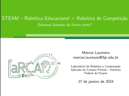

# LaTeX

Este repositório conterá algumas modelos e testes que fui realizando ao londo do tempo em LaTeX.

## Modelo de Apresentação do Laboratório
> [!TIP]
> Baixe o modelo e altere de acordo com suas necessidades. Na verdade o modelo é uma palestra que foi ministrada em dezembro/2023.

[Modelo de Apresentação](modelo_beamer_larca/)

